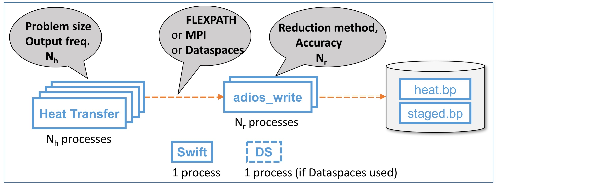

= Heat Transfer: Swift

[.lead]
This example shows how to run the heat transfer ADIOS pipeline from Swift. This application works as shown in the figure:

* The `heat` program runs a heat transfer simulation for a 2-D domain on a 2-D array of processes. (Domain size and process count can be varied.) The simulation outputs two variables, T and dT, at specified intervals.
* The two variables are passed to a second program, `adios_write`, which applies a transformation to each variable. Three transformations are supported:

** Identity 
** Compress via SZ, with specified accuracy
** Compress via ZFP, with specified accuracy

* The uncompressed and compressed results are written to two files, `heat.bp` and `staged.bp`, respectively. (Each contains both T and dT.)
* The information exchange between `heat` and `adios_write` may be performed in different ways:

** FLEXPATH: 
** MPI: 
** Dataspace: 

* Swift is used to start the `heat` and `adios_write` programs on the specified number of nodes.

== Installation

. We assume that Spack is installed on your system.

. Install Savanna via Spack and then load stc, mpix_launch, evpath, adios, mpich, and sz:
+
 spack install savanna
 spack load stc
 spack load mpix_launch
 spack load evpath
 spack load adios
 spack load mpich
 spack load sz
+
. Swift also needs zsh. It seems that there are two options:
.. `spack load zsh` (but I didn't try this)
.. `sudo apt-get install zsh`
. Build the heat transfer simulator and stager 
.. Determine the location of the code (`spack find -p savanna`), say $L, and `cd $L/Heat_Transfer`
.. Edit `Makefile` to set `CC=mpicc` and `FC=mpif90` 
.. Build heat transfer simulator and stager:
+
 cd Heat_Transfer
 make
 cd stage_write
 make

== Configure and run the basic pipeline 

. Run the workflow
.. Edit `heat_transfer.xml` to enable the `FLEXPATH` method. (Ensure that the following text, near the end of the file, is not commented out: `<method group="heat" method="FLEXPATH">QUEUE_SIZE=4;verbose=3</method>`.)
.. Edit `run-workflow.sh` to set `LAUNCH` to point to `spack find -p mpix-launch-swift`/src
.. You can also edit `workflow.swift` to modify the number of processes and problem size
.. Then, type
+
 ./run-workflow.sh P
+
where P is the number of MPI processes. (With default settings in `workflow.swift`, 12 processes are used for the simulation and 2 are used for the stager, requiring P=12 + 2 + 1 for Swift. For a quick run, edit `workflow.swift` to set P=1 for both simulation and stager, thus requiring P=3.)

== Run with compression

To perform compression through ADIOS, we need to provide additional options for `stager`:

* the list of variables to compress 
* the compression method and compression parameters to use

These are all specified in the `arguments2` variable in "workflow.swift" (line 17). 

For example, the following line requests `stager` to compress the `T` and `dT` variables with the `SZ` method, maintaining absolute errors lower than 0.001 (The latter is a SZ-specific parameter. More details can be found in the ADIOS manual).

----
arguments2 = split("heat.bp staged.bp FLEXPATH \"\" MPI \"\" \"T,dt\" \"SZ:accuracy=0.001\"", " ");
----
 
This second example does the same thing but used the ZFP compression library: 
----
arguments2 = split("heat.bp staged.bp FLEXPATH \"\" MPI \"\" \"T,dt\" \"ZFP:accuracy=0.001\"", " ");
----

[[spack]]
== Swift-T build with https://github.com/LLNL/spack[Spack]

**This material should not be needed and can be moved elsewhere, as Swift-T is included in Savanna.**

We can use Spack to build required libraries and build Swift-T with them.

. https://spack.readthedocs.io/en/latest/getting_started.html[Install Spack]
+
To use with Environment Modules, see https://spack.readthedocs.io/en/latest/module_file_support.html[here]. 
Basically, you need to install env module
+
----
yum install environment-modules
----
Or, we can use spack too
+
----
spack install environment-modules
----
and activate it:
+
----
TMP=`tempfile`
echo >$TMP
MODULE_HOME=`spack location --install-dir environment-modules`
MODULE_VERSION=`ls -1 $MODULE_HOME/Modules | head -1`
${MODULE_HOME}/Modules/${MODULE_VERSION}/bin/add.modules <$TMP
cp .bashrc $TMP
echo "MODULE_VERSION=${MODULE_VERSION}" > .bashrc
cat $TMP >>.bashrc
----

. Build required libraries 
+
----
spack install mpich tcl swig zsh
----

. Build JDK and Ant
+
To build JDK and Ant with Spack, we need extra steps.
Bascially, we need to follow instructions 
http://spack.readthedocs.io/en/latest/basic_usage.html#non-downloadable-tarballs[here].
+
Here is a short summary: Go to Java download website and download JDK (e.g., `jdk-8u131-linux-x64.tar.gz`). Then, do as follows:
+
----
mkdir -p $HOME/.spack/manual_mirror/jdk
mv jdk-8u131-linux-x64.tar.gz $HOME/.spack/manual_mirror/jdk/jdk-8u131.tar.gz
spack mirror add manual file://$HOME/.spack/manual_mirror
spack install jdk@8u131 ant ^jdk@8u131
----

. Build Swift-T
+
----
spack load mpich tcl swig zsh jdk ant
git clone https://github.com/swift-lang/swift-t.git
cd swift-t
./dev/build/init-settings.sh
----
+
Edit `dev/build/swift-t-settings.sh`. At a minimum, set the install directory with SWIFT_T_PREFIX. Then, build:
+
----
$ dev/build/build-all.sh
----
+
After sucessful building, add PATH as follows:
+
----
$ export PATH=/path/to/swift-t-install/turbine/bin:${PATH}
$ export PATH=/path/to/swift-t-install/stc/bin:${PATH}
----
