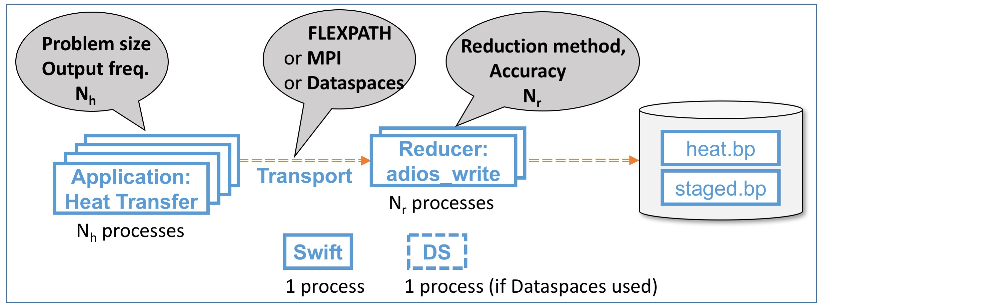

= Running the Heat Transfer/Reduction pipeline with Swift

[.lead]
This example shows how to run the heat transfer/reduction pipeline with Swift. This application works as shown in the figure, with the grey callouts indicating user-controlled options for the program.

* Swift starts two programs: the *application* (as N~h~ processes) and the *reducer* (as N~r~ processes), connected by the *transport*. As shown in the figure, it also runs a Swift control program plus (if the Dataspaces transport is used) a Dataspaces process. *Q: Is it true that Dataspaces involves a separate process?*
* *Application*: The `Heat Transfer` program runs a heat transfer simulation for a 2-D domain on a 2-D array of processes)
(Domain size and process count can be varied.) It outputs two variables, T and dT, at specified intervals.
* *Reducer*: The `adios_write` program applies a reduction operation to each variable and writes the uncompressed and compressed results to two files, `heat.bp` and `staged.bp`, respectively. (Each file contains both T and dT.) Three reductions are supported:

** Identity 
** Compress via SZ, with specified accuracy
** Compress via ZFP, with specified accuracy

* *Transport*: Three options are supported, as follows.

** FLEXPATH: *The only one tested so far. Description TBD*
** MPI: *Description TBD*
** Dataspace: *Description TBD*

* As 1 process is needed for Swift, and 1 process for the Dataspaces transport if used, the pipeline involves N~h~ + N~r~ + 1 or N~h~ + N~r~ + 2 processes. It is conventional to supply that number as the argument to the `run-workflow.sh` command described below. (Swift does not yet provide control for the mapping of processes to cores and nodes.)

In the following, we describe in turn:

* How to install the Savanna package that you will use to run the pipeline
* How to perform a single execution of a pipeline such as that shown in the figure
* How to use the Cheetah system to configure and run a campaign involving multiple executions

== Installation

. We assume that Spack is installed on your system. But in case of interest, these steps work on a Linux Ubuntu workstation (some elements, such as zlib* and zsh may already be available on some systems):
+
 sudo apt install git
 sudo apt install curl
 sudo apt install gfortran
 sudo apt install bison
 sudo apt install flex
 sudo apt install environment-modules
 sudo apt install zlib*
 sudo apt install zsh
 git clone  https://github.com/CODARcode/spack
 . spack/share/spack/setup-env.sh
+
Then edit `~/.spack/compilers.yaml` (on Ubuntu, at least, it's in `~/.spack/linux/compilers.yaml`) and add /usr/bin/gfortran for both f77 and fcc.
+
It seems to help to restart at this point.

. Install Savanna via Spack and then `spack load` required modules:
+
 cd spack
 git checkout -t origin/codar
 spack install savanna@develop
 spack load stc turbine adios mpich sz
+
. Build the heat transfer simulator and stager 
.. Determine the location of the code (`spack find -p savanna`), say $L, and `cd $L/Heat_Transfer`. The following will work as long as you only have one Savanna installed:
+
 path2savanna = `spack find -p savanna | grep savanna | awk '{ print $2 }'`
 cd $path2savanna/Heat_Transfer
 
.. Edit `Makefile` to set `CC=mpicc` and `FC=mpif90` 
.. Build heat transfer simulator and stager:
+
 make
 cd stage_write
 make

== Configure and run the basic pipeline, with and without compression 

. Run the workflow
.. Configure staging method
... To use FlexPath: edit `heat_transfer.xml` to enable the `FLEXPATH` method. (Ensure that the following text, near the end of the file, is not commented out: `<method group="heat" method="FLEXPATH">QUEUE_SIZE=4;verbose=3</method>`. All other lines starting with `<method group="heat" method...` should be commented out.) 
... To use DataSpaces: edit `heat_transfer.xml` to enable the `DATASPACES` method. (In this case the following line should not be commented out: `<method group="heat" method="DATASPACES"/>`, while all other lines starting with `<method group="heat" method...` should be commented out.) 
.. Edit `run-workflow.sh` to set `LAUNCH` to point to `spack find -p mpix-launch-swift`/src
.. You can also edit `workflow.swift` to modify the number of processes and problem size
.. Then, type
+
 ./run-workflow.sh P [DATASPACES|FLEXPATH]
+
where P is the number of MPI processes. (With default settings in `workflow.swift`, 12 processes are used for the simulation and 3 are used for the stager, requiring P=12 + 3 + 1 for Swift = 16. If DataSpaces transport method is used, then an additional process will be required, for a total of 17. For a quick run, edit `workflow.swift` to set 1 each for both simulation and stager, thus requiring P=1+1+1=3 (four with DataSpaces.) The second option specifies the staging transport. If no staging transport is specified, FlexPath will be used.

. Run with compression

To perform compression through ADIOS, we need to provide additional options for `stager`:

* the list of variables to compress 
* the compression method and compression parameters to use

These are all specified in the `arguments2` variable in "workflow.swift" (line 62). 

For example, the following line requests `stager` to compress the `T` and `dT` variables with the `SZ` method, maintaining absolute errors lower than 0.001 (The latter is a SZ-specific parameter. More details can be found in the ADIOS manual).

----
arguments2 = split("heat.bp staged.bp FLEXPATH \"\" MPI \"\" \"T,dt\" \"SZ:accuracy=0.001\"", " ");
----
 
This second example does the same thing but used the ZFP compression library: 
----
arguments2 = split("heat.bp staged.bp FLEXPATH \"\" MPI \"\" \"T,dt\" \"ZFP:accuracy=0.001\"", " ");
----

== Run a multiple-experiment campaign with Cheetah

We have described how to execute a single instance of the pipeline. The *Cheetah* system allows you to run a *campaign* involving a set of such executions, each with different configuration parameters.

Instructions on how to run with Cheetah are https://github.com/CODARcode/cheetah[on a separate page].
